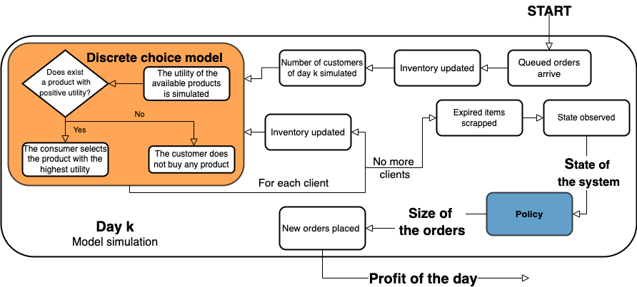

# PerishableDCM

This library simulates the inventory control problem of perishable products by means of Discrete Choice Methods (DCM).

### Dynamics of the simulation

## Available features

|Feature| Implemented options|
|:------|:------------------:|
|Demand Distribution| Poisson, Normal|
|DCM| Linear Beta (Transchel, S. (2017). Inventory management under price-based and stockout-based substitution)|
||

## Requirements

| Name | | Version employed | Description        | Website |
|:-----|:-:|:-----------:|:---------------------:|:-----------:|
| gym | >= | 0.23.1 | Toolkit for developing and comparing reinforcement learning algorithms| <https://gym.openai.com/>
